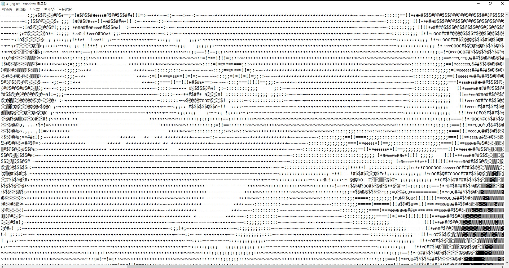

## 결과물 (전 / 후)
___


<p align="center" style="color:gray">
  
  위 결과물을 확대한 모습
</p> 

## 사용방법
* * *
필요 라이브러리
- Opencv   
`pip install opencv-python`

main.py 와 print_txt.py 의 코드에 폴더의 경로를 수정해주면 된다.   

- main.py -> 사진이 있는 폴더에 .txt파일을 추가해줌   
- print_txt.py -> txt파일을 만들지 않고 명령 프롬프트에서 곧바로 볼 수 있음
- video.py -> 영상을 아스키 코드로 표현하여 나타내줌

### main.py 수정하기
아래 두 가지를 바꿔주면 정상적으로 작동한다
```python
file_path = 'input_file_path' #다운받은 폴더까지의 경로를 입력해주면 된다.
바꾸기 예시) -> file_path = 'C:\\User\\Username\\Desktop\\draw_asciicode"
```
```python
f = open("input_file_path\\temp.txt", 'w', -1, "utf-8") #temp.txt는 수정하지 말것
바꾸기 예시) -> f = open("C:\\User\\Username\\Desktop\\draw_asciicode\\temp.txt", 'w', -1, "utf-8")
```
### print_txt.py 수정하기  
```python
file_path = 'input_file_path'
바꾸기 예시) -> file_path = 'C:\\User\\Username\\Desktop\\draw_asciicode"
```
main에서 수정했던 코드와 같다

### video.py 사용하기
---
video 폴더에 변환하고 싶은 영상을 넣은 후
```python
cap = cv2.VideoCapture('video/파일이름.mp4')
```
이렇게 경로명을 지정해 주면 해당하는 비디오가 변환된다.

## 변경가능사항
---
```python
char = ' .,-◂~:;=!*ᧉө#$@░▒▓█'
```
이 코드는 명암의 종류를 나타내는 코드이다   
 
굳이 바꾸지 않아도 되지만, 좀 더 현실감 있는 묘사를 위해서는 텍스트의 색깔에 따라 이 순서를 바꿀 필요가 있다

만약 기본 명령 프롬프트처럼 검은 배경에 텍스트가 흰색이라면 공백은 검은색의 역할을 할 것이다. 그리고 █는 흰색을 담당하게 된다.   
따라서 만약 일반 메모장이 아닌 다른 곳에서 실행을 한다면 23번 줄의
```python
index = -(index + 1) #(흑백 반전)
```
이 코드를 추가하거나 지워가면서 본인에게 맞는 스타일을 찾을 수 있다.

추가로  .,-◂~:;=!*ᧉө#$@░▒▓█ 이 문자열 사이에 적합한 문자를 집어넣으면 좀 더 세밀한 그림까지 구현이 가능하니 재미삼아 찾아서 넣어보는 것 또한 좋은 방법이다.